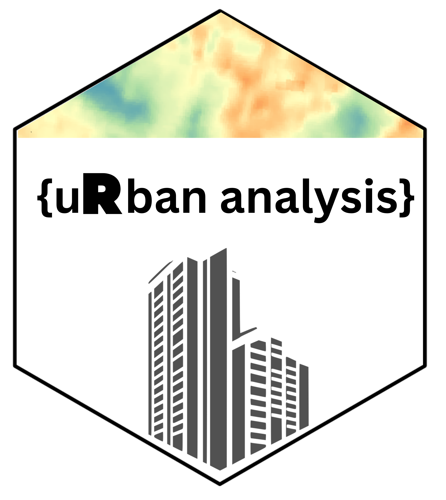
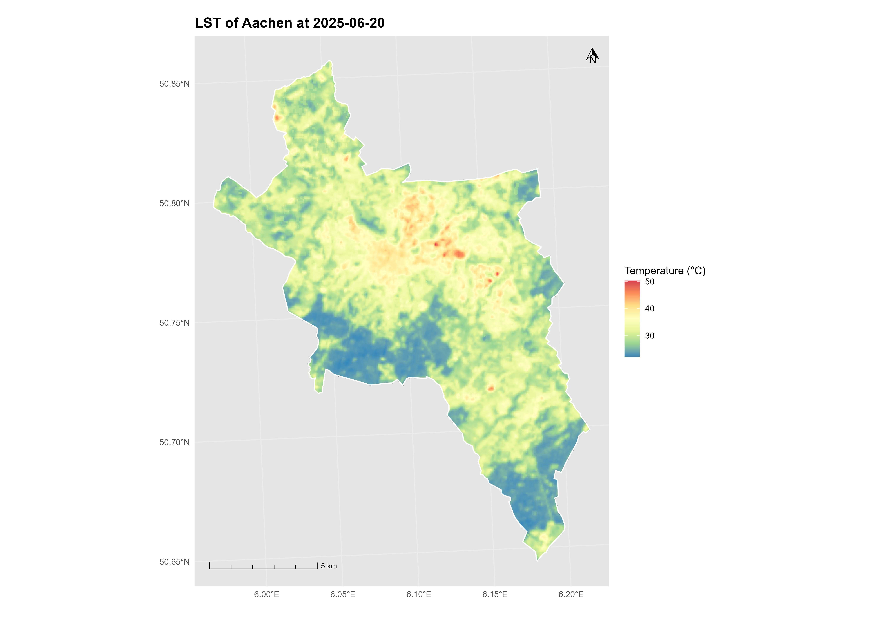
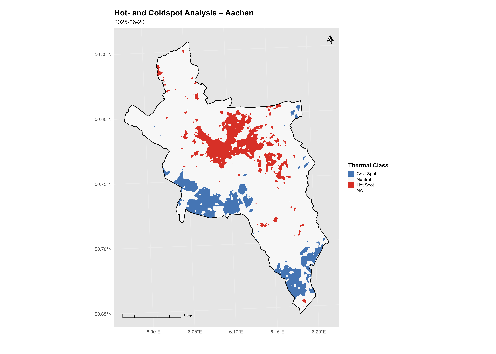
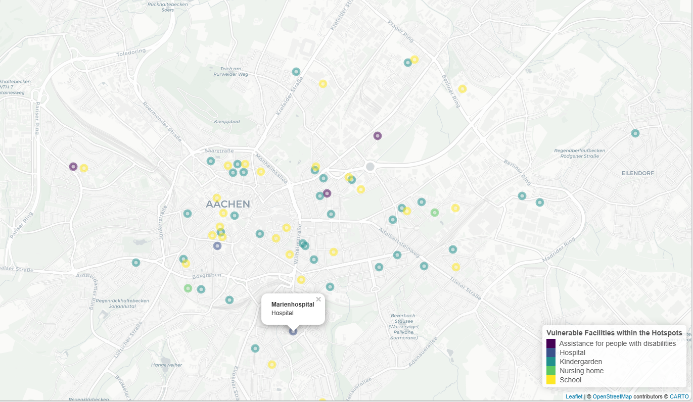
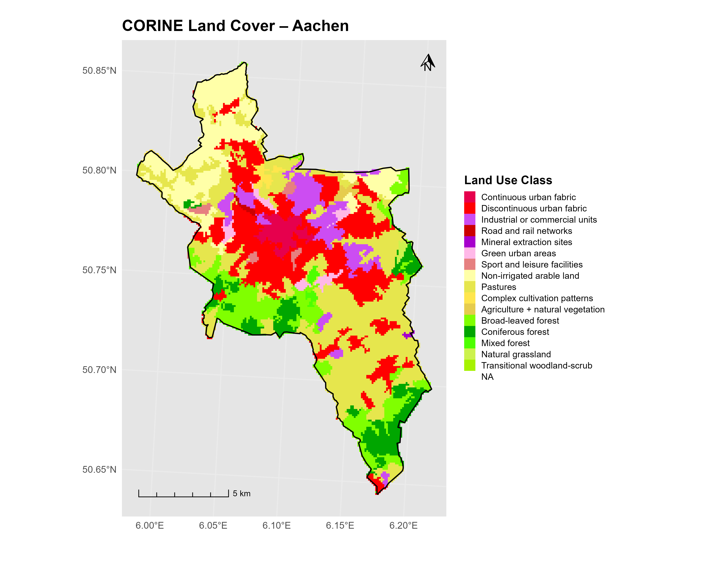
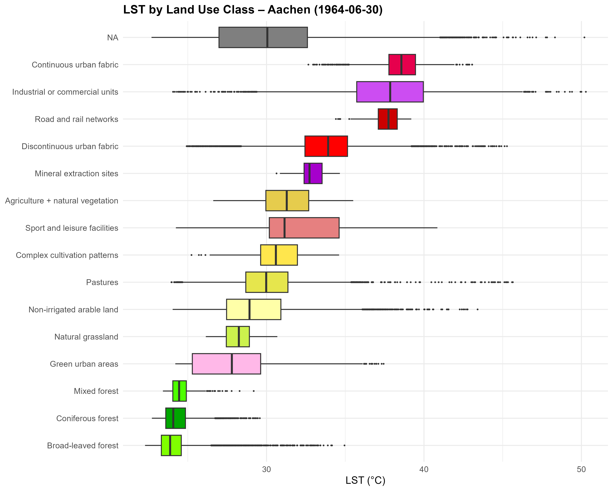

<!-- README.md is generated from README.Rmd. Please edit that file -->

# uRban.analysis



This package aims to support decision-makers with ready-to-use analyses
of urban phenomena, especially urban heat.

Deaths in connections with heat are no longer a rarity, as the heat
waves of recent years have shown. In the summer of 2022 ca. 62.862
people have died because of the heat all over europe (Ballester et
al. 2023:1857). With an global temperature increase of 1.5°C 30.000 heat
related deaths can be expected in Europe (Bednar-Friedl et
al. 2023:1860). The health effects of heat waves are particularly severe
in cities. Cities have a high degree of soil sealing, often with little
vegetation and high building density. For climate-resilient urban
planning, it is important to know the heat distribution of cities in
order to be able to counteract areas of intense heat trough appropiate
measures f.ex. green roofs.

This R-Package is designed to give decision-makers the ability to
conduct a quick analysis of their city. Using a previously selected
Landsat thermal image the Land Surface Temperature is plotted within the
city boundaries. Furthermore, hotspots and coldspots can be identified.
In addition the Land Cover of the city can be retrieved and plotted
based on the CORINE land cover dataset. So that the temperature
distribution per Land Cover Class can be detected.

## Requirements

This package requires following packages:

\-`dplyr` -`geodata` -`ggplot2` -`ggspatial` -`sf` -`terra` -`tidyterra`
-`osmdata` -`leaflet`

``` r
#Check if packages are missing and install automatically 
packages_needed <- c("terra", "sf", "ggplot2", "dplyr", "tidyterra", "geodata", "ggspatial", "osmdata", "leaflet")
not_installed <- packages_needed[!(packages_needed %in% installed.packages () [,"Package"])]
if(length(not_installed)) install.packages(not_installed)

print(paste(length(not_installed), "package had to be installed."))
```

Additionally packages requires following data to run all the functions:

- ‘ST_B10 surface temperature product’ (Landsat Collection 2 Level-2)
  that covers the entire study area - can be downloaded via the [USGS
  Earthexplorer](https://earthexplorer.usgs.gov/)
- \`CORINE Land Cover dataset’ - can be downloaded via the [Copernicus
  Land Monitoring
  Service](https://land.copernicus.eu/en/products/corine-land-cover/clc2018)

## Installation

You can install the development version of uRban.analysis from
[GitHub](https://github.com/) with:

``` r
Package installation can be done directly by calling: 

  'devtools::install_github("Lara-A-O/uRban.analysis")'

Alternatively you can also use: 
  pak::pak("Lara-A-O/uRban.analysis")
  
```

## Functions

| Function | Short Description |
|----|----|
| `get_city_boundary()` | Gets the boundary of a german city |
| `get_LST()` | Calculates the Land Surface Temperature (LST) for the city out of a given Landsat Acquisition |
| `LST_plotted()` | Creates a ready-to-use map of the LST |
| `get_hotcoolspots()` | Creates a ready-to-use-map of the hotspots and coldspots |
| `table_facilities_heat()` | Creates a list of vulnerable facilities within the hotspots |
| `map_facilities_heat()` | Creates a map of vulnerable facilities within the hotspots |
| `get_LULC()` | Prepares the corine dataset for the next steps |
| `LULC_plotted()` | Creates a ready-to-use map of the Land Use/Land Cover (LULC) of the city |
| `statistics_LULC_LST()` | Creates boxplots of the temperature distribution within the LULC Classes |

## Example Workflow

This is an example workflow on how to use the uRban.analysis package:

#### Getting the package started

Load the `uRban.analysis`-Package and the dependent packages:

``` r

library(uRban.analysis)

library(dplyr)
library(geodata)
library(ggplot2)
library(ggspatial)
library(sf)
library(terra)
library(tidyterra)
library(leaflet)
```

#### Getting the city boundary with `get_city_boundary()`

The first step is to define the area of interest. You have the option of
using your own sf object or using the `get_city_boundary` function based
on the GADM Database to retrieve the boundaries of a German city.

``` r
#Example on how to use "get_city_boundary()"

Aachen <- get_city_boundary("Aachen")

#If the output is unknown the following output is generated: "City not found in GADM database:"
#To check if the right boundary is being produced use: 

print(Aachen)
```

#### Getting the Land Surface Temperature with `get_LST()`

Now that an SF object for the desired study area is available, the
ST_B10 image is loaded, cropped to fit the study area, and the LST ist
calculated with the `get_LST()` function

**The `ST_B10` band must be a Landsat Collection 2 Level-2 thermal band,
as the formula applies to the official USGS scaling factor and offset**

``` r
lst_result <- get_LST(
 st_b10_path = "C:/Users/LaraO/EAGLE_Master/1_Semester/New R-Package/LC08_L2SP_197025_20250620_20250627_02_T1_ST_B10.TIF",
 city = "Aachen", 
 date = as.Date("2025-06-20") )
```

#### Create a ready-to-use Map of the Land Surface Temperature with `LST_plotted()`

Maps of the Land Surface Temperature can be useful to get an overview of
the temperature distribution in the city. With the function
`LST_plotted()` such a map can be created in seconds. The required input
for this function is the result of `get_LST()`

``` r
LST_plotted (lst_result)
```

**Output of `LST_plotted()`**


#### Create a ready-to-use map of Hot and Cool Spots in the City with `get_hotcoolspots()`

In order to make recommendations for action, it is necessary to identify
temperature extrema. The coldest areas can be potential places to cool
off, the hottest places should be examined for their potential to reduce
temperatures. The function `get_hotcoolspots` creates such a map based
on `get_LST`

``` r

get_hotcoolspots(
 lst_result= lst_result, 
 hot_quantile= 0.95,
 cold_quantile= 0.05)

# The numbers for the hot and cold quantile can be adjusted as desired, depending on which extreme range is to be considered. 
# By default the highest and coldest 10% are being considered. 
```

**Output of `get_hotcoolspots()`**



#### Get the heat vulnerable facilities within the hotspots with `table_facilities_heat()`

The elderly, children and people with chronic illnesses are particularly
vulberable to heat. For a climate-resilient city, it is therfore
particularly important to plan in such a way that social and medical
facilities where members of these population groups gather are protected
from extreme heat. The function `table_facilities_heat()`identifies
which facilities, such as kindergardens, schools, nursing homes,
assistance for people with people with disabilities and youth services
are within LST hotspots.

Inspiration for this function is the map of the [Hessisches Landesamt
für Naturschutz und
Geologie](https://www.wiesbaden.de/medien/downloads/leben-in-wiesbaden/umwelt-naturschutz/Einrichtungen-und-Anzahl-der-heissen-Tage-in-der-Innenstadt.pdf)

``` r

table_facilities_heat(
  lst_result =lst_result, 
  percentile = 0.9
)
```

#### Map heat vulnerable facilities within the hotspots with `map_facilities_heat`

Based on the previous function `table_facilities_heat()`
`map_facilities_heat()`creates an interactive leaflet map showing the
affected facilities.

``` r

df <- table_facilities_heat(lst_result, percentile=0.9)

map_facilities_heat(df)
```

**Output of `map_facilities_heat()`**



#### Get the information about the Land Use and Land Cover of the city with `get_LULC()`

A Land Use and Land Cover (LULC) Map can be useful to provide some
context in regards of urban topics f.ex. heat. The Funktion `get_LULC()`
serves as a preliminary step in the creation of a LULC map and further
analysises. The [CORINE Land Cover
dataset](https://land.copernicus.eu/en/products/corine-land-cover)
serves as the basis

``` r
lulc_result <- get_LULC(
 path_to_CORINE = "C:/Users/LaraO/EAGLE_Master/1_Semester/New R-Package/U2018_CLC2018_V2020_20u1.tif")
 city = "Aachen"
```

#### Create a ready-to-use map of the Land Use and Land Cover of the city with `LULC_plotted()`

The function `LULC_plotted()`creates a map of the LULC present in the
city based on the previous function `get_LULC()`

``` r
LULC_plotted( 
 clc_path = "C:/Users/LaraO/EAGLE_Master/1_Semester/New R-Package/U2018_CLC2018_V2020_20u1.tif",
 city = "Aachen")
```

**Output of `LULC_plotted()`**


#### Analyze the Land Surface Temperature per Land Cover Class with `statistics_LULC_LST()`

By analyzing the land surface temperature per Land Cover Class decision
makers can identify where targeted adaption measures will have the
greatest impact. The function `statistics_LULC_LST()` based on the
results of `get_LULC()` and `get_LST()`creates on overview of the
temperature distribution per class using boxplots.

``` r
statistics_LULC_LST(lulc_result, lst_result)
```

**Output of `statistics_LULC_LST()`**


### Restrictions and Disclaimer

- In the R-Package the Land Surface Temperature serves as a proxy for
  heat. It is important to mention that health effects are caused by the
  air temperature in relation of other factors such as humidity, wind
  but also age. The assumption that the LST can be used to estimate the
  heat exposure is very simplified also because the used Landsat image
  is captured in the morning and therefore does not represent the
  highest temperatures in the afternoon as well as temperatures at
  night. Nevertheless, the LST may provide a starting point for further
  research.

- Because the CORINE dataset is used, the package is limited to European
  cities. However, the principle of the functions can be adapted to
  national LULC Classifications outside of Europe.

### Sources

- Ballester, J./Quijal-Zamorano, M./Méndez Turrubiates, R. /Pegenaute,
  F./Herrmann, F./Robine, J./Basagaña, X./Tonne, C./Antó, J.
  /Achebak, H. (2023): Heat-related mortality in Europe during the
  summer of 2022. In: Nature medicine 29(7), 1857–1866.

- Bednar-Friedl, B./Biesbroek, R./Schmidt, D./Alexander, P./Børsheim,
  K./Carnicer, J./Georgopoulou, E./Haasnoot, M. (2023): Europe. In:
  Change, I.P.o.C. (Hrsg.) 2023: Climate Change 2022 – Impacts,
  Adaptation and Vulnerability: Cambridge University Press 18171928.
